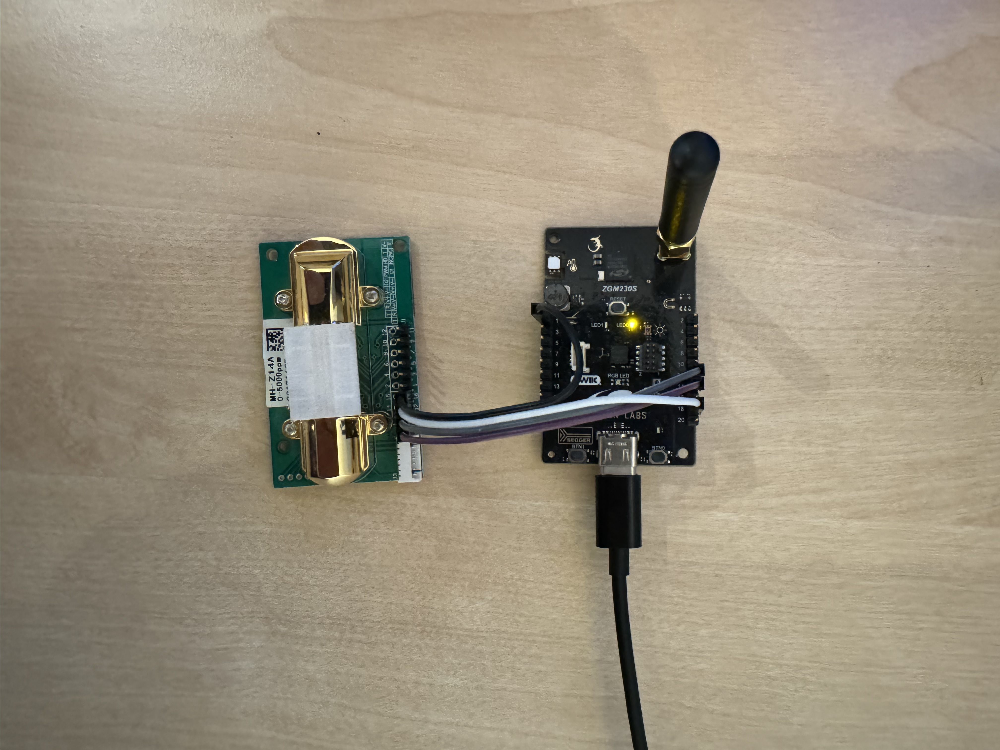
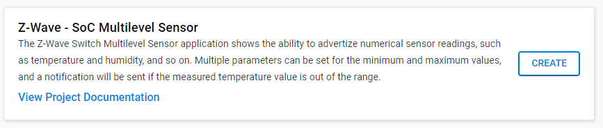
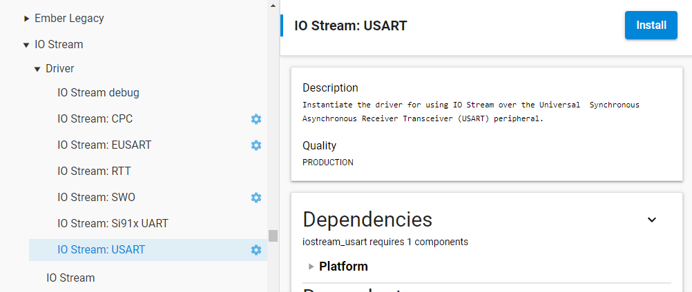
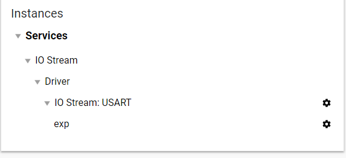
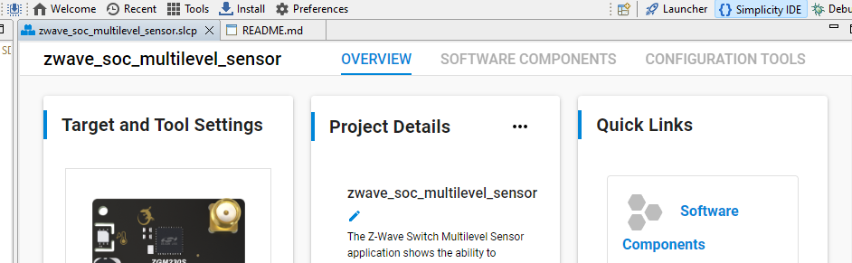
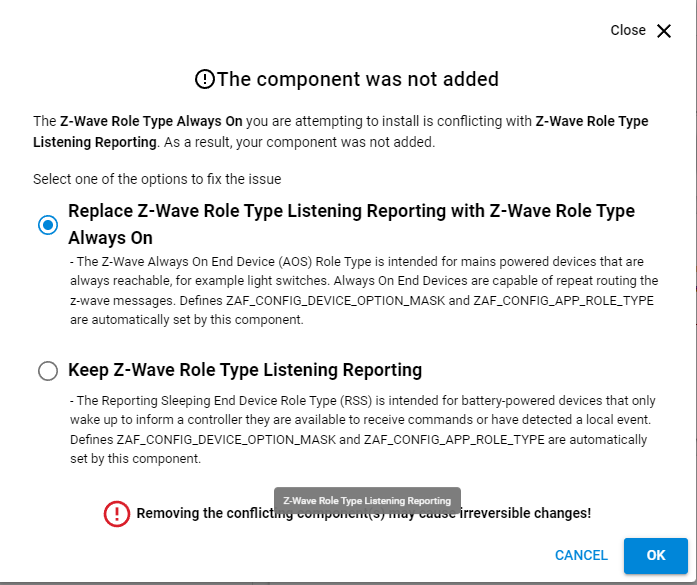

# Building a Z-Wave End Device based on Silicon Labs ZGM230-DK2603A (Z-Wave 800 Series Development Kit)
### Author: [Olav Tollefsen](https://www.linkedin.com/in/olavtollefsen/)

## Introduction

This article shows how to extend the "Z-Wave - SoC Multilevel Sensor" example project with functional configuration parameters, add code to use the onboard Bosch Sensortec BMP384 pressure sensor and how to add a CO2 sensor connected to the UART terminals of the ZGM230-DK2603A development board.

This article is based on Silicon Labs Gecko SDK version 4.4.0

### What you will need

- A PC running Windows as the development workstation.
- Install Simplicity Studio V5 from Silicon Labs.
- Silicon Labs ZGM230-DK2603A Development Kit.
- CO2 sensor with serial port (UART) connection. I'm using a Winsen MH-Z14A.

This article assumes that you have already installed Simplicity Studio V5 and the Gecko SDK 4.4.0



## Create the initial project based on the "Z-Wave - SoC Multilevel Sensor" example project

Start by creating a new project in Simplicity Studio V5 by selecting the "Z-Wave - SoC Multilevel Sensor" example project and click "Create":



This is a good starting point as it already implements a fully functional Z-Wave device with support for most of the sensors found on the development kit board.

The example project defines a couple of configuration parameters, but strangely it does not use any of the configuration variables in the code and there is little or no documentation available to show how to use configuration variables.

## Add some configuration parameters

First I would like to add a couple of commenly used configuration parameters for a device with sensors:

1) A configuration parameter for controlling how often the device will send sensor reports to the controller.
2) A configuration parameter to calibrate the temperature sensor

Add the following yaml code after the last definition of configuration parameters in the file "Config/cc_config/MultilevelSensor.cc_config":

```
    - name: "Sensor report interval"
      number: 3
      file_id: 2
      info: "Time interval between consecutive sensor reports"
      size: CC_CONFIG_PARAMETER_SIZE_16_BIT
      format: CC_CONFIG_PARAMETER_FORMAT_UNSIGNED_INTEGER
      min_value: 30
      max_value: 65535
      default_value: 120
      altering_capabilities: 0
      read_only: 0
      advanced: 0
    - name: "Temperature sensor calibration"
      number: 4
      file_id: 3
      info: "Calibrates temperature sensor by +/- degrees celsius. Scale is 10."
      size: CC_CONFIG_PARAMETER_SIZE_16_BIT
      format: CC_CONFIG_PARAMETER_FORMAT_SIGNED_INTEGER
      min_value: -60
      max_value: 60
      default_value: 0
      altering_capabilities: 0
      read_only: 0
      advanced: 0
    - name: "Enable CO2 Automatic Baseline Correction"
      number: 5
      file_id: 4
      info: "Enable CO2 Automatic Baseline Correction."
      size: CC_CONFIG_PARAMETER_SIZE_8_BIT
      format: CC_CONFIG_PARAMETER_FORMAT_UNSIGNED_INTEGER
      min_value: 0
      max_value: 1
      default_value: 1
      altering_capabilities: 0
      read_only: 0
      advanced: 0
```

Note! Editing and saving this file will trigger an automatic generation of some source files based on the information added in the yaml file.

## Add code to get configuration parameters at run-time

Now we need to add some supporting functions to get the configuration parameters during run-time.

Create a C header file in the project root named "configuration_parameters.h"

Add the following code:

```
#ifndef CONFIGURATION_PARAMETERS_H_
#define CONFIGURATION_PARAMETERS_H_

int32_t get_minimum_temperature_limit_parameter();

int32_t get_maximum_temperature_limit_parameter();

uint32_t get_sensor_report_interval_ms_parameter();

int16_t get_temperature_sensor_calibration_parameter();

int8_t get_enable_co2_automatic_baseline_correction_parameter();

#endif /* CONFIGURATION_PARAMETERS_H_ */
```

Create a C source file in the project root named "configuration_parameters.c"

Add the following code:

```
// -----------------------------------------------------------------------------
//                   Includes
// -----------------------------------------------------------------------------
#include <CC_Configuration.h>
#include "configuration_parameters.h"

#define MINIMUM_TEMPERATURE_LIMIT 1
#define MAXIMUM_TEMPERATURE_LIMIT 2
#define REPORT_INTERVAL_SECONDS 3
#define TEMPERATURE_SENSOR_CALIBRATION 4
#define CO2_AUTOMATIC_BASELINE_CORRECTION 5

int32_t get_minimum_temperature_limit_parameter()
{
  int32_t minimum_temperature_limit = -30;
  cc_config_parameter_buffer_t parameter_buffer;
  bool success = cc_configuration_get(MINIMUM_TEMPERATURE_LIMIT, &parameter_buffer);
  if (success)
  {
      minimum_temperature_limit = parameter_buffer.data_buffer.as_int32;
  }

  return minimum_temperature_limit;
}

int32_t get_maximum_temperature_limit_parameter()
{
  int32_t maximum_temperature_limit = -30;
  cc_config_parameter_buffer_t parameter_buffer;
  bool success = cc_configuration_get(MAXIMUM_TEMPERATURE_LIMIT, &parameter_buffer);
  if (success)
  {
      maximum_temperature_limit = parameter_buffer.data_buffer.as_int32;
  }

  return maximum_temperature_limit;
}

uint32_t get_sensor_report_interval_ms_parameter()
{
  uint16_t report_interval_seconds = 120;
  cc_config_parameter_buffer_t parameter_buffer;
  bool success = cc_configuration_get(REPORT_INTERVAL_SECONDS, &parameter_buffer);
  if (success)
  {
      report_interval_seconds = parameter_buffer.data_buffer.as_uint16;
  }

  uint32_t report_interval_ms = report_interval_seconds * 1000;

  return report_interval_ms;
}

int16_t get_temperature_sensor_calibration_parameter()
{
  int16_t temperature_sensor_calibration = 0;
  cc_config_parameter_buffer_t parameter_buffer;
  bool success = cc_configuration_get(TEMPERATURE_SENSOR_CALIBRATION, &parameter_buffer);
  if (success)
  {
      temperature_sensor_calibration = parameter_buffer.data_buffer.as_int16;
  }

  return temperature_sensor_calibration;
}

int8_t get_enable_co2_automatic_baseline_correction_parameter()
{
  int8_t co2_automatic_baseline_correction = 1;
  cc_config_parameter_buffer_t parameter_buffer;
  bool success = cc_configuration_get(CO2_AUTOMATIC_BASELINE_CORRECTION, &parameter_buffer);
  if (success)
  {
      co2_automatic_baseline_correction = parameter_buffer.data_buffer.as_int8;
  }

  return co2_automatic_baseline_correction;
}
```

## Add code to use configuration parameters at run-time

Now we can add some code to use the configuration parameters at the approperiate places in the code.

First modify the code to use the "Sensor report interval" configuration parameter.

Open the file "gecko_sdk_4.3.2/protocol/z-wave/ZAF/CommandClasses/MultilevelSensor/src/CC_MultilevelSensor_Support.c"

It's a bit unfortunate that the one have to modify the SDK-supplied code for this. Ideally there should have been some extensibility points allow for this code to run without changing the SDK source code.

Add the following line to the includes file section:

```
#include "configuration_parameters.h"
```

Locate the function "cc_multilevel_sensor_init".

Replace this line:

```
  AppTimerDeepSleepPersistentStart(&cc_multilevel_sensor_autoreport_timer, MULTILEVEL_SENSOR_DEFAULT_AUTOREPORT_PEDIOD_MS);
```

with:

```
  uint32_t report_interval_ms = get_sensor_report_interval_ms_parameter();
  AppTimerDeepSleepPersistentStart(&cc_multilevel_sensor_autoreport_timer, report_interval_ms);
```

Locate the function "cc_multilevel_sensor_autoreport_callback".

Replace this line:

```
  AppTimerDeepSleepPersistentStart(&cc_multilevel_sensor_autoreport_timer, MULTILEVEL_SENSOR_DEFAULT_AUTOREPORT_PEDIOD_MS);
```

with:

```
  uint32_t report_interval_ms = get_sensor_report_interval_ms_parameter();
  AppTimerDeepSleepPersistentStart(&cc_multilevel_sensor_autoreport_timer, report_interval_ms);
```

Now add code to use the other configuration parameters:

Open the file "gecko_sdk_4.3.2/protocol/z-wave/platform/SiliconLabs/AppsHw/src/MultilevelSensor/MultilevelSensor_interface_sensor.c"

Add the following line to the includes file section:

```
#include "configuration_parameters.h"
```

Locate the function "cc_multilevel_sensor_air_temperature_interface_read_value".

Find this line of code:

```
    MultilevelSensor_temperature_humidity_sensor_read(&rh_data, &temp_data);
```

add the following code right after:
```
    int16_t temperature_sensor_calibration = get_temperature_sensor_calibration_parameter();

    // Adjust for calibration offset, 10 = 1.0 degrees Celsius
    temp_data += (temperature_sensor_calibration * 100);
```

Move this line of code located inside the if-statement just above the if-statement:

```
    temperature_celsius_divided = (float)temp_data/(float)1000;
```

Then add the following lines of code just after the statement you just moved:

```
    int32_t minimum_temperature_limit = get_minimum_temperature_limit_parameter();
    int32_t maximum_temperature_limit = get_maximum_temperature_limit_parameter();

    if ((temperature_celsius_divided < minimum_temperature_limit) || (temperature_celsius_divided > maximum_temperature_limit))
      return false; // Discard reading
```

We are now using all the configuration parameters. You can build the code, deploy it to the development board and test it.

## Add support for the Bosch Sensortec BMP384 pressure sensor

There is a Bosch Sensortec BMP384 pressure sensor present on the ZGM230-DK2603A board, but the sample project does not include any code to use it. We will now add configuration / code to use it.

### Add the "Pressure device driver for BMP3XX"

Open the .slcp file in your project and select "SOFTWARE COMPONENTS".

Locate "Platform->Board Drivers->Pressure device driver for BMP3XX", select it and click "Install"

### Add configuration for the Bosch Sensortec BMP384 pressure sensor

First we add a sensor with a supported type to the project.

Open the file "config/cc_config/MultilevelSensor.cc_config".

Add the following yaml to the end of the sensors section:

```

    barometric_pressure:
      name: SENSOR_NAME_POWER
      scales:
        - SENSOR_SCALE_WATT
```
This will cause these files to be auto-generated:
- autogen/cc_multilevel_sensor_config.h
- autogen/cc_multilevel_sensor_config.c

Copy the two generated files to the root of the project. Then delete all the yaml definitions for all the sensors from "config/cc_config/MultilevelSensor.cc_config". This should cause the two auto-generated files to disappear.

Now implement the code to read the barometric pressure values.

Add the following C source file to the root of the project "multilevel_sensor_barometric_pressure_interface.c"

Add this code to the file:

```
// -----------------------------------------------------------------------------
//                   Includes
// -----------------------------------------------------------------------------
#include <cc_multilevel_sensor_config.h>
#include "sl_i2cspm_instances.h"
#include "sl_bmp3xx.h"
#include <math.h>
#include <string.h>
#include <ZW_typedefs.h>

bool cc_multilevel_sensor_barometric_pressure_interface_read_value(sensor_read_result_t* o_result, uint8_t i_scale)
{
  UNUSED(o_result);
  UNUSED(i_scale);

  if(o_result == NULL)
    return true;

  float pressure;
  int8_t result;

  memset(o_result, 0, sizeof(sensor_read_result_t));
  o_result->precision  = SENSOR_READ_RESULT_PRECISION_3;
  o_result->size_bytes = SENSOR_READ_RESULT_SIZE_4;

  result = sl_bmp3xx_init(sl_i2cspm_sensor);

  if (result != SL_STATUS_OK) {
    return false;
  }

  // Returns pressure in Kilopascal (kPa)
  result = sl_bmp3xx_measure_pressure(sl_i2cspm_sensor, &pressure);

  if (i_scale == 0x01)
  {
    // Convert to Inches of Mercury, https://www.weather.gov/media/epz/wxcalc/pressureConversion.pdf
    pressure = 0.295300 * pressure;
  }

  if (result != SL_STATUS_OK) {
    return false;
  }

  int32_t pressure_result = roundf(pressure);

  o_result->raw_result[3] = (uint8_t)(pressure_result & 0xFF);
  o_result->raw_result[2] = (uint8_t)((pressure_result >> 8 ) & 0xFF);
  o_result->raw_result[1] = (uint8_t)((pressure_result >> 16) & 0xFF);
  o_result->raw_result[0] = (uint8_t)((pressure_result >> 24) & 0xFF);

  return true;
}
```

### Use correct sensor type for the barometric pressure sensor

Now we need to do some tricks to workouround the lack of support for the barometric pressure sensor in the Gecko SDK. 

Open the file "cc_multilevel_sensor_config.c" that we copied to the root of the project:

Add the following line to the includes file section:

```
#include <string.h>
```

This is the auto-generated code for our CO2 sensor (using the supported type Power):
```
  cc_multilevel_sensor_init_interface(&cc_multilevel_sensor_barometric_pressure, SENSOR_NAME_POWER);
  cc_multilevel_sensor_add_supported_scale_interface(&cc_multilevel_sensor_barometric_pressure, SENSOR_SCALE_WATT);
  cc_multilevel_sensor_barometric_pressure.init = cc_multilevel_sensor_barometric_pressure_interface_init;
  cc_multilevel_sensor_barometric_pressure.deinit = cc_multilevel_sensor_barometric_pressure_interface_deinit;
  cc_multilevel_sensor_barometric_pressure.read_value = cc_multilevel_sensor_barometric_pressure_interface_read_value;
  cc_multilevel_sensor_registration(&cc_multilevel_sensor_barometric_pressure);
  ```

  This code needs to be changed to:
```
  static const sensor_type_t barometric_pressure_sensor_type = {.value = 0x09, .byte_offset = 2, .bit_mask = 0, .max_scale_value = 0x00};

  memset(&cc_multilevel_sensor_barometric_pressure, 0, sizeof(cc_multilevel_sensor_barometric_pressure));
  cc_multilevel_sensor_barometric_pressure.sensor_type = &barometric_pressure_sensor_type;
  cc_multilevel_sensor_add_supported_scale_interface(&cc_multilevel_sensor_barometric_pressure, 0x00); // 0x00 = "Kilopascal (kPa)"
  cc_multilevel_sensor_barometric_pressure.init = cc_multilevel_sensor_barometric_pressure_interface_init;
  cc_multilevel_sensor_barometric_pressure.deinit = cc_multilevel_sensor_barometric_pressure_interface_deinit;
  cc_multilevel_sensor_barometric_pressure.read_value = cc_multilevel_sensor_barometric_pressure_interface_read_value;
  cc_multilevel_sensor_registration(&cc_multilevel_sensor_barometric_pressure);
  ```

  You should now be able to build the project, deploy to your hardware and test!


## Add support for a CO2 sensor using UART (serial communication)

To be able to connect the CO2 sensor to the Z-Wave 800 ZGM230-DK2603A board, I soldered two 10-pin headers to the EXP headers on the board.

Connect TX from the CO2 sensor to RX on the ZGM230-DK2603A board and RX to TX. My CO2 sensor use 5V, so I connect those together and GND. It then looks like the photo on top of this article.

### Add support for UART to the project

Open the .slcp file in your project and select "SOFTWARE COMPONENTS".

Locate "Services->IO Stream->Driver->IO Stream: USART", select it and click "Install"



Select the name "exp" and click Done.

When the installation is completed click on "Instances":


Click on the gear icon to the right of "exp":



Make sure the settings are correct for  your CO2 sensor. I changed only the Baud rate to 9600.

### Add configuration for the CO2 sensor to the project

Due to some unknown reason, Silicon Labs only supports a subset of sensor types in the SDK (ZAF). It's therefore not straight forward to add support for the CO2 sensor.

First we add a sensor with a supported type to the project.

Open the file "config/cc_config/MultilevelSensor.cc_config".

Add the following yaml to the end of the sensors section:

```

    co2:
      name: SENSOR_NAME_POWER
      scales:
        - SENSOR_SCALE_WATT
```

This will cause these files to be auto-generated:
- autogen/cc_multilevel_sensor_config.h
- autogen/cc_multilevel_sensor_config.c

Now we need to do some tricks to workouround the lack of support for the CO2 sensor.

Copy the two generated files to the root of the project. Then delete all the yaml definitions for all the sensors from "config/cc_config/MultilevelSensor.cc_config". This should cause the two auto-generated files to disappear.

Now implement the code to read the CO2-sensor values.

Add the following C source file to the root of the project "multilevel_sensor_co2_interface.c"

Add this code to the file:

```
/*
 * multilevel_sensor_co2_interface.c
 *
 *  Created on: Oct 24, 2023
 *      Author: olavt
 */
// -----------------------------------------------------------------------------
//                   Includes
// -----------------------------------------------------------------------------
#include <cc_multilevel_sensor_config.h>
#include <math.h>
#include <string.h>
#include <stddef.h>
#include <stdbool.h>
//#define DEBUGPRINT
#include "DebugPrint.h"
#include "ZW_typedefs.h"
#include "FreeRTOS.h"
#include "task.h"

#include "sl_iostream.h"
#include "sl_iostream_uart.h"
#include "sl_iostream_init_instances.h"
#include "sl_iostream_handles.h"
#include "configuration_parameters.h"

#ifndef UNUSED
#define UNUSED(x) (void)(x)
#endif

#ifndef BUFSIZE
#define BUFSIZE    80
#endif

static char buffer[BUFSIZE];
static sl_iostream_t* sensor_stream;
static bool abc_enabled = false;

bool enable_abc()
{
  return (get_enable_co2_automatic_baseline_correction_parameter() == 1);
}

char calculate_checksum(char *buffer, int length)
{
  char checksum = 0;
  for(int i = 1; i < length - 1; i++)
  {
    checksum += buffer[i];
  }
  checksum = 0xff - checksum;
  checksum += 1;

  return checksum;
}

bool checksum_ok(char *buffer, int length)
{
  char calculated_checksum = calculate_checksum(buffer, length);
  char checksum = buffer[length - 1];

  return (calculated_checksum == checksum);
}

// Automatic Baseline Correction (ABC function)
// ABC function refers to that sensor itself do zero point judgment and automatic calibration
// procedure intelligently after a continuous operation period. The automatic calibration cycle is
// every 24 hours after powered on. The zero point of automatic calibration is 400ppm. From
// July 2015, the default setting is with built-in automatic calibration function. To use the sensor
// better, the sensor must be placed in clean air
bool enable_automatic_baseline_correction(sl_iostream_t* sensor_stream)
{
  const char enableABCCommand[] = { 0xFF, 0x01, 0x79, 0xA0, 0x00, 0x00, 0x00, 0x00, 0xE6 };
  sl_status_t status;
  size_t bytes_read;

  status = sl_iostream_write(sensor_stream, enableABCCommand, sizeof(enableABCCommand));
  if (status != SL_STATUS_OK)
    return false;

  // Wait a bit to allow sensor to respond before reading response
  vTaskDelay(pdMS_TO_TICKS(200));

  status = sl_iostream_read(sensor_stream, &buffer, sizeof(buffer), &bytes_read);
  if (status != SL_STATUS_OK)
    return false;

  // Check expected response length
  if (bytes_read != 9)
    return false;

  // Check the checksum
  if (!checksum_ok(buffer, bytes_read))
    return false;

  abc_enabled = true;

  return true;
}

bool disable_automatic_baseline_correction(sl_iostream_t* sensor_stream)
{
  const char disableABCCommand[] = { 0xFF, 0x01, 0x79, 0x00, 0x00, 0x00, 0x00, 0x00, 0x86 };
  sl_status_t status;
  size_t bytes_read;

  status = sl_iostream_write(sensor_stream, disableABCCommand, sizeof(disableABCCommand));
  if (status != SL_STATUS_OK)
    return false;

  // Wait a bit to allow sensor to respond before reading response
  vTaskDelay(pdMS_TO_TICKS(200));

  status = sl_iostream_read(sensor_stream, &buffer, sizeof(buffer), &bytes_read);
  if (status != SL_STATUS_OK)
    return false;

  // Check expected response length
  if (bytes_read != 9)
    return false;

  // Check the checksum
  if (!checksum_ok(buffer, bytes_read))
    return false;

  abc_enabled = false;

  return true;
}

bool get_co2_concentration_reading(sl_iostream_t* sensor_stream, int32_t *co2_ppm)
{
  if (enable_abc() && !abc_enabled)
    enable_automatic_baseline_correction(sensor_stream);
  else if (!enable_abc() && abc_enabled)
    disable_automatic_baseline_correction(sensor_stream);

  const char getCO2ConcentrationCommand[] = { 0xff, 0x01, 0x86, 0x00, 0x00, 0x00, 0x00, 0x00, 0x79 };
  sl_status_t status;
  size_t bytes_read;

  status = sl_iostream_write(sensor_stream, getCO2ConcentrationCommand, sizeof(getCO2ConcentrationCommand));
  if (status != SL_STATUS_OK)
    return false;

  // Wait a bit to allow sensor to respond before reading response
  vTaskDelay(pdMS_TO_TICKS(200));

  status = sl_iostream_read(sensor_stream, &buffer, sizeof(buffer), &bytes_read);
  if (status != SL_STATUS_OK)
    return false;

  // Check expected response length
  if (bytes_read != 9)
    return false;

  // Check the checksum
  if (!checksum_ok(buffer, bytes_read))
    return false;

  *co2_ppm = (int32_t)((buffer[2] << 8) | buffer[3]);

  return true;
}

void clear_input_buffer(sl_iostream_t* sensor_stream)
{
  sl_status_t status;
  size_t bytes_read;

  do
  {
    // Note! This assumes non-blocking read.
    status = sl_iostream_read(sensor_stream, &buffer, sizeof(buffer), &bytes_read);
    if (status != SL_STATUS_OK)
      return;

  } while (bytes_read > 0);
}

bool cc_multilevel_sensor_co2_interface_init(void)
{
  sensor_stream = sl_iostream_get_handle("exp");

  // Use non-blocking reads
  sl_iostream_uart_set_read_block((sl_iostream_uart_t*)sensor_stream, false);

  clear_input_buffer(sensor_stream);

  if (enable_abc())
    enable_automatic_baseline_correction(sensor_stream);
  else
    disable_automatic_baseline_correction(sensor_stream);

  return true;
}

bool cc_multilevel_sensor_co2_interface_read_value(sensor_read_result_t* o_result, uint8_t i_scale)
{
  int32_t co2_ppm;
  UNUSED(i_scale);

  if(o_result != NULL)
  {
      memset(o_result, 0, sizeof(sensor_read_result_t));
      o_result->precision  = 0;
      o_result->size_bytes = SENSOR_READ_RESULT_SIZE_4;

      bool result = get_co2_concentration_reading(sensor_stream, &co2_ppm);
      if (!result)
        return false;

      DPRINTF("CO2: %d\n", co2_ppm);

      // Adjust for precision
      co2_ppm = co2_ppm * pow(10, o_result->precision);

      o_result->raw_result[3] = (uint8_t)(co2_ppm & 0xFF);
      o_result->raw_result[2] = (uint8_t)((co2_ppm >> 8 ) & 0xFF);
      o_result->raw_result[1] = (uint8_t)((co2_ppm >> 16) & 0xFF);
      o_result->raw_result[0] = (uint8_t)((co2_ppm >> 24) & 0xFF);
  }

  return true;
}
```

Note! The code above is for a Winsen MH-Z14A NDIR CO2 Module and needs to be changed if you use another CO2-sensor.

### Use correct sensor type for the CO2-sensor

Now we need to use the correct sensor type:

Open the file "cc_multilevel_sensor_config.c" that we copied to the root of the project:

Add the following line to the includes file section:

```
#include <string.h>
```

This is the auto-generated code for our CO2 sensor (using the supported type Power):
```
  cc_multilevel_sensor_init_interface(&cc_multilevel_sensor_co2, SENSOR_NAME_POWER);
  cc_multilevel_sensor_add_supported_scale_interface(&cc_multilevel_sensor_co2, SENSOR_SCALE_WATT);
  cc_multilevel_sensor_co2.init = cc_multilevel_sensor_co2_interface_init;
  cc_multilevel_sensor_co2.deinit = cc_multilevel_sensor_co2_interface_deinit;
  cc_multilevel_sensor_co2.read_value = cc_multilevel_sensor_co2_interface_read_value;
  cc_multilevel_sensor_registration(&cc_multilevel_sensor_co2);
  ```

  This code needs to be changed to:
```
  static const sensor_type_t co2_sensor_type = {.value = 0x11, .byte_offset = 3, .bit_mask = 0, .max_scale_value = 0x00};

  memset(&cc_multilevel_sensor_co2, 0, sizeof(cc_multilevel_sensor_co2));
  cc_multilevel_sensor_co2.sensor_type = &co2_sensor_type;
  cc_multilevel_sensor_add_supported_scale_interface(&cc_multilevel_sensor_co2, 0x00); // 0x00 = "Parts/million (ppm)"
  cc_multilevel_sensor_co2.init = cc_multilevel_sensor_co2_interface_init;
  cc_multilevel_sensor_co2.deinit = cc_multilevel_sensor_co2_interface_deinit;
  cc_multilevel_sensor_co2.read_value = cc_multilevel_sensor_co2_interface_read_value;
  cc_multilevel_sensor_registration(&cc_multilevel_sensor_co2);
  ```

  You should now be able to build the project, deploy to your hardware and test!

  ## Optional: Convert from Z-Wave Role Type Listening Reporting to Always On

If you want the device to be an always on device capable of participating in message routing, you can convert it to "Z-Wave Role Type Always On".

Open the file "zwave_soc_multilevel_sensor.slcp" in the root of the project.

Click on "SOFTWARE COMPONENTS"



Search for "role type" and select "Z-Wave Role Type Always On" and click "Install".



Click on "Replace Z-Wave Role Type Listening Reporting with Z-Wave Role Type Always On" and click "OK".

Change the search filter in "SOFTWARE COMPONENTS" to "Battery".

Select the "Battery Command Class - NVM" and click Uninstall.

Select the "Battery Command Class" and click Uninstall.

Change the search filter in "SOFTWARE COMPONENTS" to "Wakeup".

Select the "Wakeup Command Class" and click Uninstall.

If you build the code now, you will get some errors.

To fix this, we need to remove / change some code related to the Listening Reporting role type:

Open the file "app.c" located in the root of the project.

Remove this refence to the include file:

```
#include "CC_Battery.h"
```

Locate these lines of code:

```
ApplicationTask(SApplicationHandles* pAppHandles)
{
  EResetReason_t resetReason;
```

Add the following code under:

```
  UNUSED(resetReason);
```

Locate and remove these lines of code:

```
  /* Re-load and process Deep Sleep persistent application timers.
   * NB: Before calling AppTimerDeepSleepPersistentLoadAll here all
   *     application timers must have been been registered with
   *     AppTimerRegister() or AppTimerDeepSleepPersistentRegister().
   *     Essentially it means that all CC handlers must be
   *     initialized first.
   */
  AppTimerDeepSleepPersistentLoadAll(resetReason);

  if (ERESETREASON_DEEP_SLEEP_EXT_INT == resetReason)
  {
    app_hw_deep_sleep_wakeup_handler();
  }
```

Locate these lines of code:

```
  if(ERESETREASON_DEEP_SLEEP_EXT_INT != resetReason)
  {
    /* Enter SmartStart*/
    /* Protocol will commence SmartStart only if the node is NOT already included in the network */
    ZAF_setNetworkLearnMode(E_NETWORK_LEARN_MODE_INCLUSION_SMARTSTART);
  }
```

and replace with:

```
  /* Enter SmartStart*/
  /* Protocol will commence SmartStart only if the node is NOT already included in the network */
  ZAF_setNetworkLearnMode(E_NETWORK_LEARN_MODE_INCLUSION_SMARTSTART);
```

Locate and remove this line of code:

```
      (void) CC_Battery_LevelReport_tx(NULL,ENDPOINT_ROOT, NULL);
```

Locate this line of code and remove it:
```
  AppTimerDeepSleepPersistentResetStorage();
```

Open the file "gecko_sdk_4.3.2/protocol/z-wave/ZAF/CommandClasses/MultilevelSensor/src/CC_MultilevelSensor_Support.c"

Replace "AppTimerDeepSleepPersistentRegister" with "AppTimerRegister".

Replace "AppTimerDeepSleepPersistentStart" with "TimerStart".

Open the file "gecko_sdk_4.3.2/protocol/z-wave/platform/SiliconLabs/AppsHw/src/MultilevelSensor/MultilevelSensor_hw.c".

Remove this include file reference:

```
#include <CC_Battery.h>
```

Locate and remove this function:

```
uint8_t
CC_Battery_BatteryGet_handler(uint8_t endpoint)
{
  uint32_t VBattery;
  uint8_t  accurateLevel;
  uint8_t  roundedLevel;
  uint8_t reporting_decrements;

  UNUSED(endpoint);

  /*
   * Simple example how to use the ADC to measure the battery voltage
   * and convert to a percentage battery level on a linear scale.
   */
  ADC_Enable();
  VBattery = ADC_Measure_VSupply();
  DPRINTF("\r\nBattery voltage: %dmV", VBattery);
  ADC_Disable();

  if (MY_BATTERY_SPEC_LEVEL_FULL <= VBattery)
  {
    // Level is full
    return (uint8_t)CMD_CLASS_BATTERY_LEVEL_FULL;
  }
  else if (MY_BATTERY_SPEC_LEVEL_EMPTY > VBattery)
  {
    // Level is empty (<0%)
    return (uint8_t)CMD_CLASS_BATTERY_LEVEL_WARNING;
  }
  else
  {
    reporting_decrements = cc_battery_config_get_reporting_decrements();
    // Calculate the percentage level from 0 to 100
    accurateLevel = (uint8_t)((100 * (VBattery - MY_BATTERY_SPEC_LEVEL_EMPTY)) / (MY_BATTERY_SPEC_LEVEL_FULL - MY_BATTERY_SPEC_LEVEL_EMPTY));

    // And round off to the nearest "reporting_decrements" level
    roundedLevel = (accurateLevel / reporting_decrements) * reporting_decrements; // Rounded down
    if ((accurateLevel % reporting_decrements) >= (reporting_decrements / 2))
    {
      roundedLevel += reporting_decrements; // Round up
    }
  }
  return roundedLevel;
}
```

You should now be able to build the project, deploy to your hardware and test!


